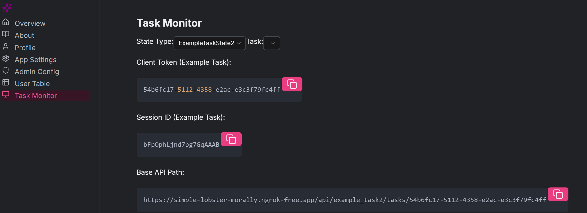

# Tasks API Documentation

## Overview

The Tasks API provides endpoints for managing and monitoring long-running tasks in the SpyGlass platform.

## API Documentation

Full API documentation is available at `<backend_url>/docs` when running the server.

## Authentication & Task Tracking

### CLIENT_TOKEN

- Required for all API calls
- Obtain from the admin dashboard at `/admins/tasks/` on the frontend client or by visiting the admin portal at `/admin/task/` if you have access, or by requesting from your system administrator
- One token applies to all tasks for a given client

### Task Progress Tracking

1. Start a task:
    To get the task_id, use the following API:
    ```bash
    POST /api/<state_name>/tasks/<client_token>/start/<task_name>
    ```

2. (WebSocket) Monitor progress:
* All tasks
    ```bash
    wscat -c /ws/<state_name>/tasks/<client_token>
    ```
* Single task
    ```bash
    wscat -c /ws/<state_name>/tasks/<client_token>/<task_id>
    ```

### Task Names

Task names can be found in the task dashboard. Current available tasks:
- [Example Task](./example_task/README.md) - Example task

## Example Response
from 
- [Example Task2](./example_task2/README.md) - Example task 2 (with args)
```json
{
  "task_id": "abc123",
  "status": "running",
  "progress": 0.75,
  "result": {
    "intermediate_steps": [...],
    "final_output": {...}
  }
}
```


